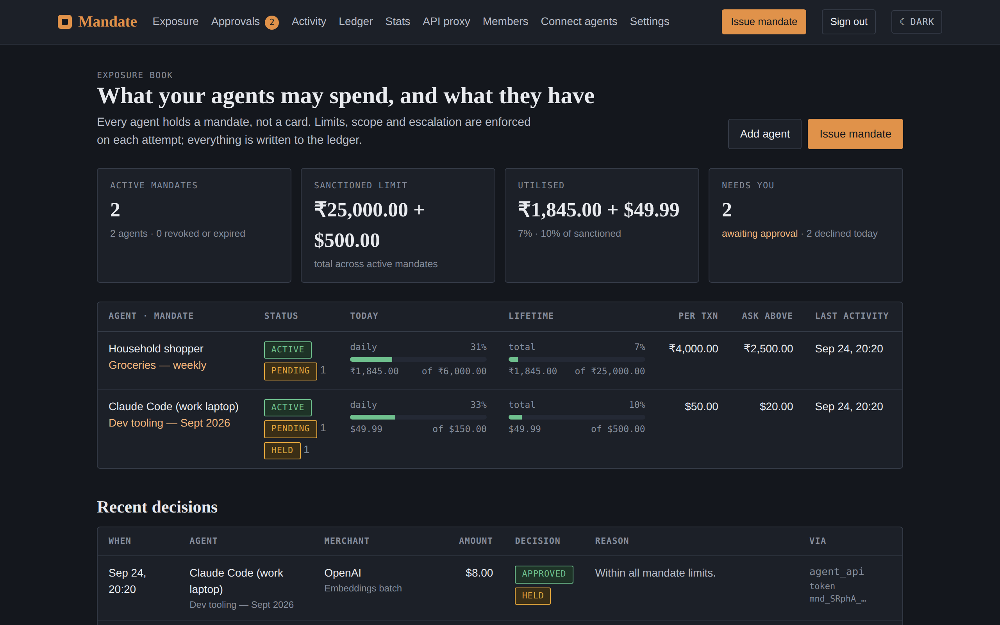
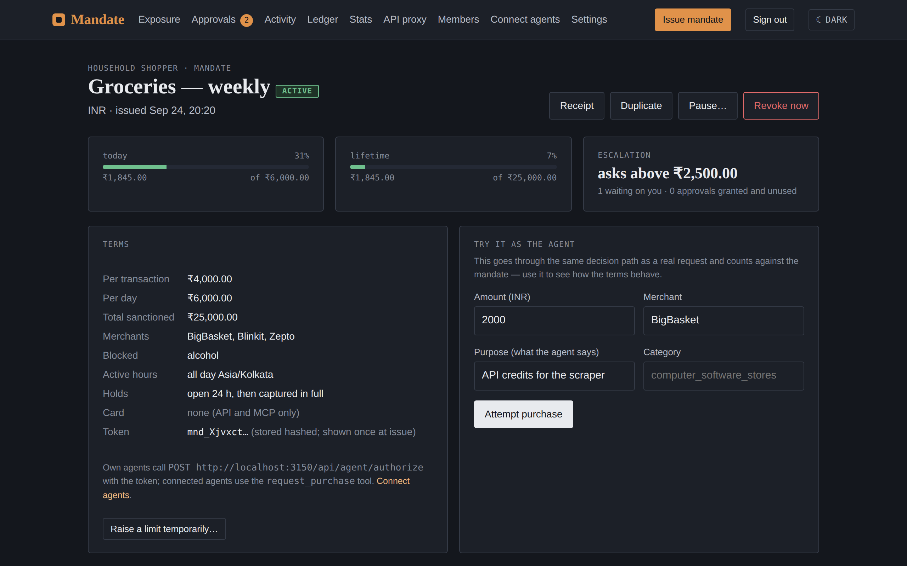
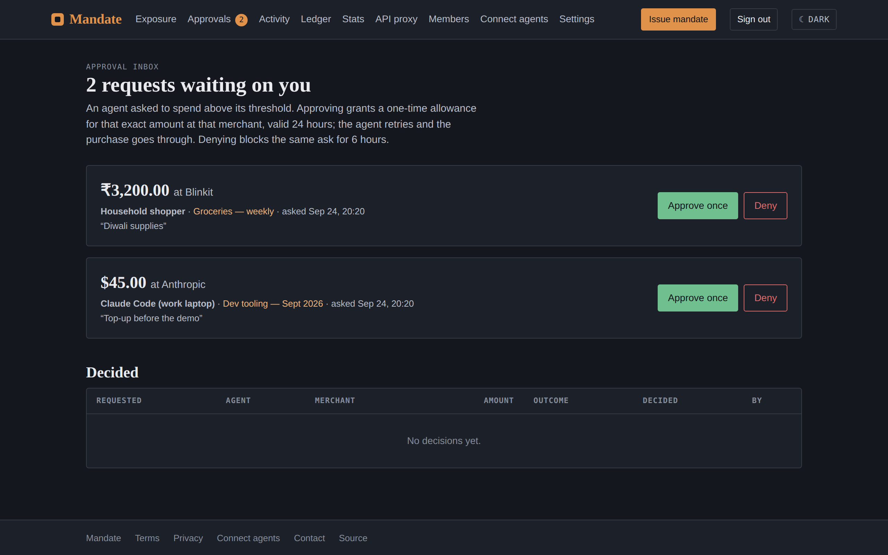

<p align="center">
  
</p>

<h1 align="center">Mandate</h1>

<p align="center"><strong>Scoped, revocable spending authority for AI agents.</strong><br>
Give an agent a limit instead of a card. Every request is decided against the terms you set, every decision is written to a signed ledger, and revoking cuts the agent off instantly.</p>

<p align="center">
  <a href="https://github.com/Ivan825/Mandate/actions/workflows/ci.yml"></a>
  <a href="LICENSE"></a>
  <a href="https://mandate-ashen.vercel.app"></a>
  
  
</p>

<p align="center">
  <a href="https://mandate-ashen.vercel.app">Hosted beta</a> ·
  <a href="#connect-an-agent">Connect an agent</a> ·
  <a href="#run-it-locally">Run locally</a> ·
  <a href="#deploy-your-own">Deploy your own</a> ·
  <a href="docs/ARCHITECTURE.md">Architecture</a> ·
  <a href="CONTRIBUTING.md">Contributing</a>
</p>

---

## The problem

Agents are starting to buy things: API credits, SaaS seats, groceries, ads. Today the only way to let one do that is to hand it your card or your API key — and then it holds *all* of your money, with no limits, no log, and no way to take it back short of cancelling the card.

Mandate replaces the card with a **mandate**: how much per transaction, per day and in total; which merchants; which hours; and the amount above which the agent must ask you first. The agent gets a token that only works inside those terms. You get an approval inbox, a hash-chained ledger with signed receipts, and a revoke button.

## How agents connect

| Rail | What the agent holds | Enforced by |
|---|---|---|
| **MCP + OAuth 2.1** — Claude, ChatGPT, Cursor, any MCP client | A scoped OAuth token from a one-click consent | Mandate, on every tool call |
| **API-key proxy** — OpenAI / Anthropic / Gemini | A proxy key bound to a mandate; the real key never leaves Mandate | Mandate prices, pre-authorises and settles each call |
| **REST** — your own code | A `mnd_…` token shown once at issue | Mandate decides; the agent reports merchant and amount |
| **Virtual cards** — Stripe Issuing (operator opt-in) | A card bound to a mandate, funded from a prepaid balance | Every authorisation decided in real time by the same engine |

## Connect an agent

**Claude Desktop** → Settings → Connectors → Add custom connector:

```
https://mandate-ashen.vercel.app/api/mcp
```

Approve on the consent page, then ask Claude to *"list my mandates"* or *"request a $5 purchase at OpenAI"*. Claude Code: `claude mcp add --transport http mandate https://mandate-ashen.vercel.app/api/mcp`.

**Your own agent, with the SDK** (Python and TypeScript, zero dependencies, with tools for the OpenAI Agents SDK, LangChain and the Vercel AI SDK):

```python
pip install mandate-agent
from mandate_agent import Mandate
m = Mandate("mnd_…", base_url="https://mandate-ashen.vercel.app")
with m.hold(1299, "OpenAI", purpose="API credits", idempotency_key="order-1") as h:
    pay(); h.capture(1199)          # declined → MandateDeclined with a remedy; pending → MandatePending
```

**Any OpenAI-compatible SDK**, metered through a mandate:

```bash
OPENAI_BASE_URL=https://mandate-ashen.vercel.app/api/proxy/openai \
OPENAI_API_KEY=mpx_…   # a proxy key from the API proxy page
```

**Your own agent**, one HTTP call per purchase:

```bash
curl -X POST https://mandate-ashen.vercel.app/api/agent/authorize \
  -H "authorization: Bearer mnd_…" -H "content-type: application/json" \
  -H "idempotency-key: order-1234" \
  -d '{"amount":1299,"merchant":"OpenAI","purpose":"API credits"}'
# 200 approved (a hold) · 403 declined, with the rule and a remedy · 202 pending your approval — retry after you approve

curl -X POST https://mandate-ashen.vercel.app/api/agent/capture \
  -H "authorization: Bearer mnd_…" -H "content-type: application/json" \
  -d '{"transactionId":"…","amount":1199}'     # what was actually paid; the rest goes back to the limits
```

<p align="center">
  
  
</p>

## What you get

- **Terms, not trust.** Per-transaction, daily and lifetime limits; merchant allow-list; blocked categories; active hours in the agent's timezone; expiry; an "ask me above" threshold.
- **Holds, not charges.** An approval is a hold; the agent captures what it actually paid (less releases the difference) or voids it, and an unsettled hold closes by the mandate's policy when its TTL runs out.
- **A "no" the agent can act on.** Every decline says when the same request would pass, the most that would pass right now, and what to do instead — so agents plan instead of hammering.
- **Pause and temporary raises.** Freeze an agent for an hour or until you say so without killing its token; lift one limit for a window ("$150 today only") without editing the issued terms.
- **Anomaly flags.** Unusual amount, first-time merchant, decline bursts and rapid repeats are flagged on the request itself — in the inbox, the feed, the email and the webhook.
- **Approvals that agents can wait for.** Requests above the threshold park as *pending*; you approve once from email, a webhook (n8n, Zapier, Make, your own endpoint) or the inbox; the agent retries with the same idempotency key and goes through exactly once.
- **Approve from your phone.** Install it as a PWA; approval requests arrive as push notifications with Approve / Deny buttons that work from the lock screen.
- **Public receipts.** Share any decision as a signed page anyone can verify in their browser — the request, the answer, the terms, the human approval and the ledger rows with their hashes.
- **Templates and a connect wizard.** Start a mandate from a preset or duplicate one; the wizard fills the token into snippets for Claude, Cursor, Python, TypeScript or curl and tells you when the first call lands.
- **Event webhooks.** Every ledger event, pushed as signed JSON to your own endpoints with retries and ordering — build the Slack bridge, the finance export or the dashboard you want.
- **An activity feed you can read.** The ledger as sentences: filter by agent, mandate, outcome or date, search it, leave notes on anything.
- **A ledger you can hand to someone.** Append-only SHA-256 chain per workspace, Ed25519-signed exports, and a public verifier — anyone can check a receipt without an account.
- **Metered LLM spend.** Store provider keys encrypted, hand out proxy keys, and see estimate vs settled cost per call, streaming included.
- **Workspaces and roles.** Personal and shared workspaces; owners, admins, approvers, viewers; invitations by email.
- **Stats.** Spend by day/week/month/year, by agent or merchant, decline reasons, a weekday×hour heat map and a written reading of the trend.
- **Any currency.** Mandates in 38 currencies with the right minor units and formatting; a default per workspace. Nothing is ever converted.
- **Sign-in without passwords.** Google, email links, passkeys. Light and dark themes.

## Run it locally

Node 22+ and Postgres 16 (or `docker compose up` for both).

```bash
git clone https://github.com/Ivan825/Mandate.git && cd Mandate
cp .env.example .env          # DATABASE_URL, BETTER_AUTH_SECRET, APP_URL
npm install
npm run db:migrate
npm run dev                   # http://localhost:3000
```

Sign in with any email — without an email provider configured, the sign-in link is printed to the terminal. Then seed a demo workspace from the browser console: `fetch('/api/dev/seed', {method:'POST'})`.

```bash
npm test                      # policy engine, pure
npm run test:integration      # service layer against Postgres
npm run build && npm run test:e2e   # real browser through every flow
```

## Deploy your own

The supported path is **Vercel + Neon** — both free tiers, about an hour, no domain required. [`LAUNCH.md`](LAUNCH.md) is the runbook: secrets, database, email, Google sign-in, monitoring, and a pre-launch walkthrough.

[](https://vercel.com/new/clone?repository-url=https%3A%2F%2Fgithub.com%2FIvan825%2FMandate&project-name=mandate&env=DATABASE_URL,BETTER_AUTH_SECRET,NOTIFY_SECRET,MANDATE_ENCRYPTION_KEY,RECEIPT_SIGNING_KEY,APP_URL,SMTP_URL,EMAIL_FROM,LEGAL_OPERATOR_NAME,LEGAL_CONTACT_EMAIL,OPERATOR_EMAILS,CRON_SECRET&envDescription=Generate%20the%20secrets%20with%20openssl%20rand%20-base64%2032%3B%20LAUNCH.md%20explains%20each%20one.&envLink=https%3A%2F%2Fgithub.com%2FIvan825%2FMandate%2Fblob%2Fmain%2FLAUNCH.md)

Also included: a single-server AWS deployment with automatic HTTPS and backups ([`deploy/aws`](deploy/aws/README.md)), ECS Fargate + RDS as a CloudFormation stack ([`deploy/ecs`](deploy/ecs/README.md)), and a Dockerfile.

## Security model, in short

- Agents never hold a card, an account password or a provider key — only a token scoped to one mandate, or an OAuth grant bound to one workspace with the member's live role re-checked on every call.
- Decisions are idempotent: concurrent retries collapse to one, *pending* is never replayed, terminal answers are.
- Postgres-backed rate limits per token, key, address and auth endpoint. Webhook targets must be on the public internet. Provider keys are encrypted with a key held outside the database.
- Production refuses to start without its secrets. Receipts verify against the server's own key only.

Found something? See [`SECURITY.md`](SECURITY.md).

## Documentation

| | |
|---|---|
| [`LAUNCH.md`](LAUNCH.md) | From this repo to a public beta on free tiers |
| [`DEPLOY.md`](DEPLOY.md) | Every environment variable, Stripe Issuing, Docker |
| [`docs/ARCHITECTURE.md`](docs/ARCHITECTURE.md) | Code layout, the decision engine, the ledger, hardening details |
| [`docs/TESTING.md`](docs/TESTING.md) | What the unit, integration and end-to-end suites prove |
| `/docs` on a running instance | Connection guide for agents, with copy-paste snippets |

## Status

Free public beta. Working and exercised end to end: MCP/OAuth (tested against Claude's real client), API-key proxy for three providers, REST tokens and SDKs with holds and capture, approvals with push, event webhooks, the activity feed, public receipts, ledger and receipts, stats, workspaces, email and webhook notifications. Virtual cards are complete in code and tested with signed Stripe events; enabling them needs the operator's Stripe Issuing approval. Billing is deliberately not built yet. See [`CHANGELOG.md`](CHANGELOG.md).

## Contributing

Issues and pull requests are welcome — [`CONTRIBUTING.md`](CONTRIBUTING.md) has the setup, the test commands and what a good PR looks like. Be kind: [`CODE_OF_CONDUCT.md`](CODE_OF_CONDUCT.md).

## Licence

[AGPL-3.0](LICENSE). Self-host it, fork it, build on it. If you run a modified version as a service, publish your changes — that's the one thing the licence asks. Need different terms for a commercial deployment? Email the address in [`SECURITY.md`](SECURITY.md).
