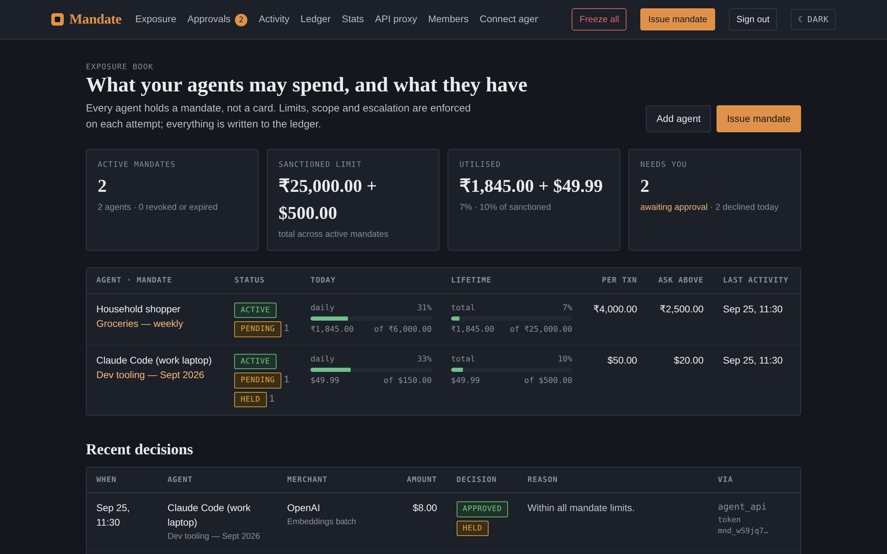
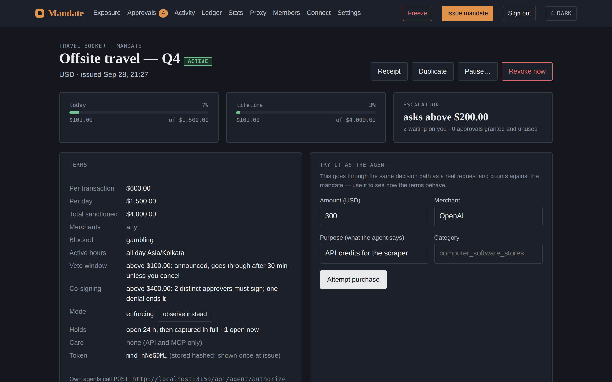
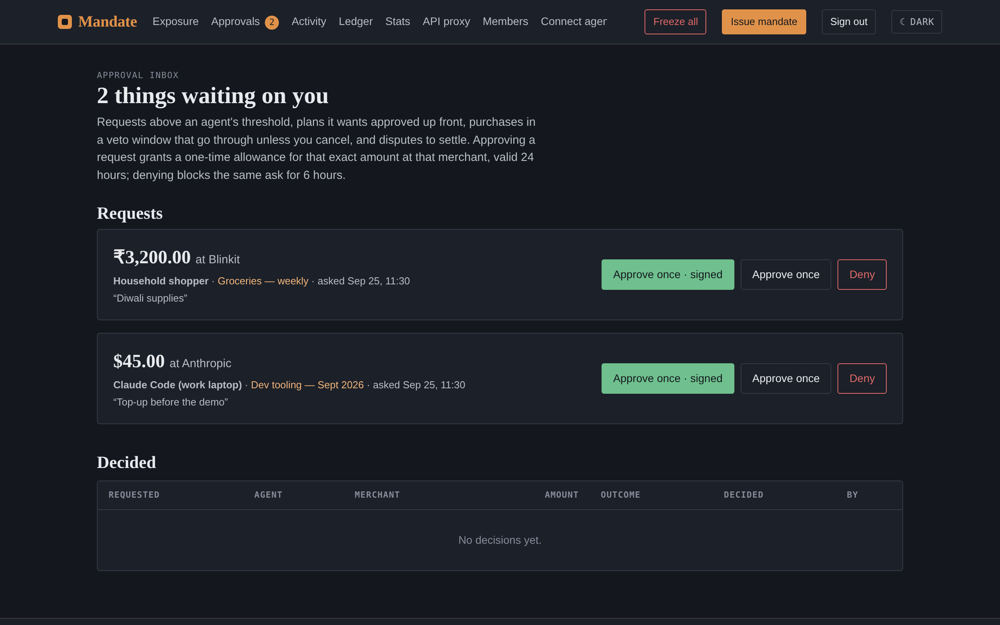
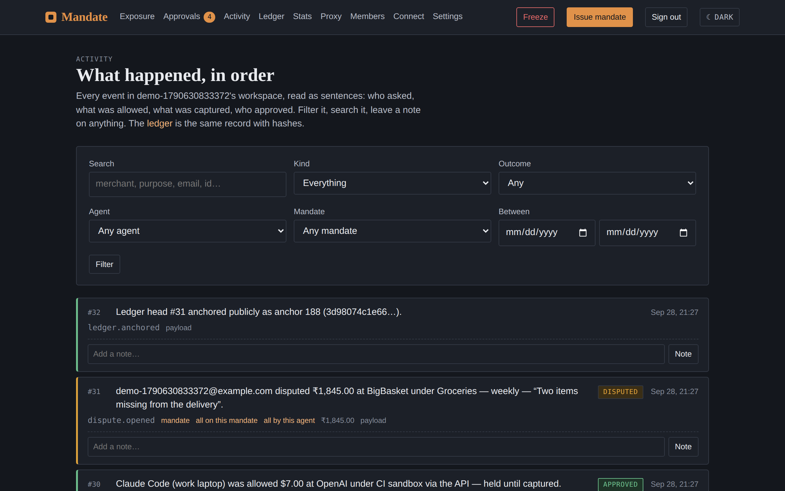
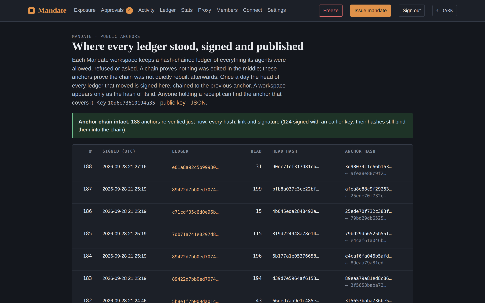

<p align="center">
  
</p>

<h1 align="center">Mandate</h1>

<p align="center"><strong>Scoped, revocable spending authority for AI agents.</strong><br>
Give an agent a limit instead of a card. Every request is decided against the terms you set, every decision is written to a signed, publicly anchored ledger, and one button freezes everything.</p>

<p align="center">
  <a href="https://github.com/Ivan825/Mandate/actions/workflows/ci.yml"></a>
  <a href="LICENSE"></a>
  <a href="https://mandate-ashen.vercel.app"></a>
  
  
</p>

<p align="center">
  <a href="https://mandate-ashen.vercel.app">Hosted beta</a> ·
  <a href="#connect-an-agent">Connect an agent</a> ·
  <a href="#run-it-locally">Run locally</a> ·
  <a href="#deploy-your-own">Deploy your own</a> ·
  <a href="docs/ARCHITECTURE.md">Architecture</a> ·
  <a href="CONTRIBUTING.md">Contributing</a>
</p>

---

## The problem

Agents are starting to buy things: API credits, SaaS seats, groceries, ads. Today the only way to let one do that is to hand it your card or your API key — and then it holds *all* of your money, with no limits, no log, and no way to take it back short of cancelling the card.

Mandate replaces the card with a **mandate**: how much per transaction, per day and in total; which merchants; which hours; and the amount above which the agent must ask you first. The agent gets a token that only works inside those terms. You get an approval inbox, a hash-chained ledger with signed receipts, and a revoke button.

## How agents connect

| Rail | What the agent holds | Enforced by |
|---|---|---|
| **MCP + OAuth 2.1** — Claude, ChatGPT, Cursor, any MCP client | A scoped OAuth token from a one-click consent | Mandate, on every tool call |
| **API-key proxy** — OpenAI / Anthropic / Gemini | A proxy key bound to a mandate; the real key never leaves Mandate | Mandate prices, pre-authorises and settles each call |
| **REST** — your own code | A `mnd_…` token shown once at issue | Mandate decides; the agent reports merchant and amount |
| **Any HTTP API** — a scraper, a data vendor, your own service | A proxy key bound to a mandate and a *target*; the credential is injected server-side | Mandate prices each call (fixed, or from the response) and settles it |
| **Vouchers** — merchants, no account needed | A signed, offline-verifiable authorisation the agent hands over with the order | The merchant verifies with a public key and redeems it for what was sold |
| **Virtual cards** — Stripe Issuing (operator opt-in) | A card bound to a mandate, funded from a prepaid balance | Every authorisation decided in real time by the same engine |

## Connect an agent

**Claude Desktop** → Settings → Connectors → Add custom connector:

```
https://mandate-ashen.vercel.app/api/mcp
```

Approve on the consent page, then ask Claude to *"list my mandates"* or *"request a $5 purchase at OpenAI"*. Claude Code: `claude mcp add --transport http mandate https://mandate-ashen.vercel.app/api/mcp`.

**Your own agent, with the SDK** (Python and TypeScript, zero dependencies, with tools for the OpenAI Agents SDK, LangChain and the Vercel AI SDK):

```python
pip install mandate-agent
from mandate_agent import Mandate
m = Mandate("mnd_…", base_url="https://mandate-ashen.vercel.app")
with m.hold(1299, "OpenAI", purpose="API credits", idempotency_key="order-1") as h:
    pay(); h.capture(1199)          # declined → MandateDeclined with a remedy; pending → MandatePending
```

**Any OpenAI-compatible SDK**, metered through a mandate:

```bash
OPENAI_BASE_URL=https://mandate-ashen.vercel.app/api/proxy/openai \
OPENAI_API_KEY=mpx_…   # a proxy key from the API proxy page
```

**Your own agent**, one HTTP call per purchase:

```bash
curl -X POST https://mandate-ashen.vercel.app/api/agent/authorize \
  -H "authorization: Bearer mnd_…" -H "content-type: application/json" \
  -H "idempotency-key: order-1234" \
  -d '{"amount":1299,"merchant":"OpenAI","purpose":"API credits"}'
# 200 approved (a hold) · 403 declined, with the rule and a remedy · 202 pending your approval — retry after you approve

curl -X POST https://mandate-ashen.vercel.app/api/agent/capture \
  -H "authorization: Bearer mnd_…" -H "content-type: application/json" \
  -d '{"transactionId":"…","amount":1199}'     # what was actually paid; the rest goes back to the limits
```

<p align="center">
  
  
</p>

## What you get

<p align="center">
  
  
</p>

**The terms.** Per-transaction, daily and lifetime limits; a merchant allow-list; blocked categories; active hours in the agent's timezone; expiry; and the amount above which the agent must ask you first. An approval is a hold, not a charge — the agent captures what it actually paid (less returns the difference) or voids it, and an unsettled hold closes by policy when its TTL runs out. Every decline says when the same request would pass, the most that would pass right now, and what to do instead.

**Ways to say yes.**
- **Ask me above** — the classic threshold; approve once from the inbox, an email link, a webhook or a push notification with Approve / Deny on the lock screen.
- **Veto windows** — "above $50, tell me and go ahead in 15 minutes unless I cancel." Approval by silence for the amounts that shouldn't wake you up.
- **Plans** — the agent lists what it intends to buy; you approve the list once; each item then passes without a prompt.
- **Co-signing** — above a threshold, two (or up to five) distinct people must sign; one denial ends it.
- **Approval routing** — "above $500 → finance", "category travel → ops", "this mandate → its sponsor". The first matching route decides who is notified and whose inbox owns the request.
- **Human-signed approvals** — approve with a passkey and the receipt carries a WebAuthn signature over the exact decision: proof a person on a registered device decided, not a script with a cookie.

**Ways to say stop.**
- **Panic button** — two clicks freeze every agent in the workspace on every rail, without revoking anything; lift it and everything is exactly as it was.
- **Pause** an agent for an hour or until you say so; **revoke** and it is cut off instantly, sub-mandates included.
- **Disputes** — contest any decision from its row; the mandate can pause; approvers settle it as refunded (the limits net down), upheld or withdrawn.
- **Anomaly flags** — unusual amount, first-time merchant, decline bursts and rapid repeats, flagged on the request itself.

**Authority that travels.**
- **Vouchers** — an approval comes with a signed token the agent hands to the merchant, who verifies it offline with a public key and redeems it for what was actually sold. A payment authorisation with no card network in the loop.
- **Sub-mandates** — an agent carves a narrower mandate out of its own for a helper: limits within its own, merchants within its list, no later expiry. The helper's spend counts against the parent and dies with it; three levels deep.
- **Temporary raises** — lift one limit for a window ("$150 today only") without editing the issued terms.

**Tuning without risk.**
- **Shadow mode** — run new terms without enforcing them and get a report of what would have been declined or asked, then switch to enforce.
- **Policy time-travel** — change the terms and replay the mandate's real history through the real engine to see which past decisions would have gone the other way.
- **Graduated autonomy** — a mandate that earns its limits: every N clean decisions the per-transaction limit and the ask-me-above threshold step up toward a ceiling; a denial steps them back.
- **Sandbox mandates** — `mnd_test_` tokens that decide, ask and record exactly like live ones, never touch a card or a real API, stay out of your totals and reset in one click.
- **Templates and a connect wizard** — start from a preset or duplicate a mandate; the wizard fills the token into snippets for Claude, Cursor, Python, TypeScript or curl and tells you when the first call lands.

**A record nobody can quietly rewrite.**
- **Ledger** — append-only SHA-256 chain per workspace, Ed25519-signed exports, a public verifier.
- **Public anchoring** — once a day every ledger head that moved is signed into a deployment-wide anchor chain at `/anchors`, so not even the operator can rebuild history unnoticed; receipts point at the anchor that covers them.
- **Public receipts** — share any decision as a signed page anyone can verify in their browser: the request, the answer, the terms, the human approval and the ledger rows with their hashes.
- **Activity feed** — the ledger as sentences: filter by agent, mandate, outcome or date, search it, leave notes on anything.
- **Event webhooks** — every ledger event pushed as signed JSON to your own endpoints with retries and ordering; build the Slack bridge, the finance export or the dashboard you want.

**Metering and money.**
- **LLM proxy** — store OpenAI / Anthropic / Gemini keys encrypted, hand out proxy keys, see estimate vs settled cost per call, streaming included.
- **Any API as a governed merchant** — add a target with its credential and a price per call (fixed, from a response header, or from the JSON); every call is decided and recorded like a purchase.
- **Virtual cards** — Stripe Issuing cards bound to a mandate and funded from a prepaid balance, every swipe decided in real time (operator opt-in).
- **Any currency** — 38 currencies with the right minor units; a default per workspace; nothing is ever converted. **Stats** by day/week/month, by agent or merchant, decline reasons, a weekday×hour heat map.

**People.** Personal and shared workspaces; owners, admins, approvers, viewers; invitations by email; sign-in with Google, email links or passkeys; installable as a PWA; light and dark themes.

## Run it locally

Node 22+ and Postgres 16 (or `docker compose up` for both).

```bash
git clone https://github.com/Ivan825/Mandate.git && cd Mandate
cp .env.example .env          # DATABASE_URL, BETTER_AUTH_SECRET, APP_URL
npm install
npm run db:migrate
npm run dev                   # http://localhost:3000
```

Sign in with any email — without an email provider configured, the sign-in link is printed to the terminal. Then seed a demo workspace from the browser console: `fetch('/api/dev/seed', {method:'POST'})`.

```bash
npm test                      # policy engine, pure
npm run test:integration      # service layer against Postgres
npm run build && npm run test:e2e   # real browser through every flow
```

## Deploy your own

The supported path is **Vercel + Neon** — both free tiers, about an hour, no domain required. [`LAUNCH.md`](LAUNCH.md) is the runbook: secrets, database, email, Google sign-in, monitoring, and a pre-launch walkthrough.

[](https://vercel.com/new/clone?repository-url=https%3A%2F%2Fgithub.com%2FIvan825%2FMandate&project-name=mandate&env=DATABASE_URL,BETTER_AUTH_SECRET,NOTIFY_SECRET,MANDATE_ENCRYPTION_KEY,RECEIPT_SIGNING_KEY,APP_URL,SMTP_URL,EMAIL_FROM,LEGAL_OPERATOR_NAME,LEGAL_CONTACT_EMAIL,OPERATOR_EMAILS,CRON_SECRET&envDescription=Generate%20the%20secrets%20with%20openssl%20rand%20-base64%2032%3B%20LAUNCH.md%20explains%20each%20one.&envLink=https%3A%2F%2Fgithub.com%2FIvan825%2FMandate%2Fblob%2Fmain%2FLAUNCH.md)

Also included: a single-server AWS deployment with automatic HTTPS and backups ([`deploy/aws`](deploy/aws/README.md)), ECS Fargate + RDS as a CloudFormation stack ([`deploy/ecs`](deploy/ecs/README.md)), and a Dockerfile.

## Security model, in short

- Agents never hold a card, an account password or a provider key — only a token scoped to one mandate, or an OAuth grant bound to one workspace with the member's live role re-checked on every call.
- Decisions are idempotent: concurrent retries collapse to one, *pending* is never replayed, terminal answers are.
- Postgres-backed rate limits per token, key, address and auth endpoint. Webhook targets must be on the public internet. Provider keys are encrypted with a key held outside the database.
- Production refuses to start without its secrets. Receipts, vouchers and anchors verify against the server's own key only (or a listed retired key after a rotation); the daily public anchor chain means even the operator cannot rewrite a ledger unnoticed.
- Audited: every rail, connection and stored secret was reviewed for 0.7.1, each finding fixed and pinned by a test — the record, including what is still open, is [`docs/SECURITY-AUDIT.md`](docs/SECURITY-AUDIT.md).
- The panic button is a workspace fact the engine checks first, on every rail, before any mandate is consulted.

Found something? See [`SECURITY.md`](SECURITY.md).

## Documentation

| | |
|---|---|
| [`LAUNCH.md`](LAUNCH.md) | From this repo to a public beta on free tiers |
| [`DEPLOY.md`](DEPLOY.md) | Every environment variable, Stripe Issuing, Docker |
| [`docs/ARCHITECTURE.md`](docs/ARCHITECTURE.md) | Code layout, the decision engine, the ledger, hardening details |
| [`docs/TESTING.md`](docs/TESTING.md) | What the unit, integration and end-to-end suites prove |
| `/docs` on a running instance | Connection guide for agents, with copy-paste snippets |

## Status

Free public beta, version 0.7.1. Working and exercised end to end (136 browser-driven checks, 41 integration tests, 22 unit tests): MCP/OAuth (tested against Claude's real client), the LLM proxy for three providers and custom API targets, REST tokens and SDKs with holds, capture and vouchers, approvals with push, co-signing and routing, veto windows, plans, sub-mandates, disputes, the panic button, shadow mode, time-travel, graduated autonomy, passkey-signed approvals, sandbox mandates, event webhooks, the activity feed, public receipts, public ledger anchoring, stats, workspaces, email and webhook notifications. Virtual cards are complete in code and tested with signed Stripe events; enabling them needs the operator's Stripe Issuing approval. Billing is deliberately not built yet. See [`CHANGELOG.md`](CHANGELOG.md).

## Contributing

Issues and pull requests are welcome — [`CONTRIBUTING.md`](CONTRIBUTING.md) has the setup, the test commands and what a good PR looks like. Be kind: [`CODE_OF_CONDUCT.md`](CODE_OF_CONDUCT.md).

## Licence

[AGPL-3.0](LICENSE). Self-host it, fork it, build on it. If you run a modified version as a service, publish your changes — that's the one thing the licence asks. Need different terms for a commercial deployment? Email the address in [`SECURITY.md`](SECURITY.md).
